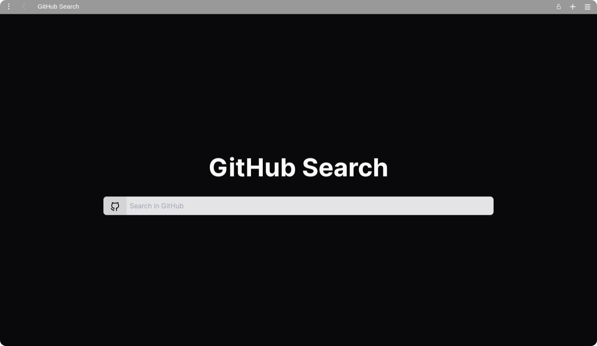

<div align="center">

# Github Search

<a href="https://opensource.org/licenses/MIT">

</a>
<br/>
<br/>

Search users and repositories from github with a beautiful and minimalist interface.

<br/>
<br/>

<br/>
<br/>

</div>

## Technologies used

- <a href="https://reactjs.org/" target="_blank">React</a>
- <a href="https://www.typescriptlang.org/" target="_blank">Typescript</a>
- <a href="https://vitejs.dev/" target="_blank">Vite</a>
- <a href="https://vite-plugin-ssr.com/" target="_blank">vite-plugin-ssr</a>
- <a href="https://unocss.dev/" target="_blank">UnoCSS</a>
- <a href="https://docs.github.com/en/rest" target="_blank">Github API</a>

## Usage

<a href="https://github-search-six-sepia.vercel.app">Use it here</a>.

## Local development

```bash
# Clone the repository
git clone https://github.com/datsfilipe/github-search.git
# Enter the project folder
cd github-search
# Install the dependencies with pnpm or your favorite package manager
pnpm install
# Run the development server
pnpm dev
```
