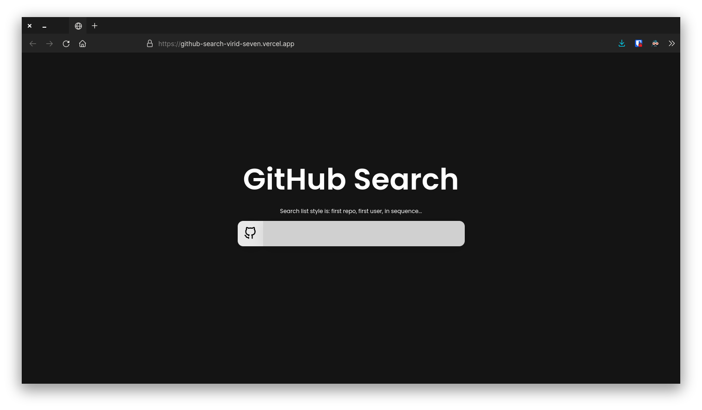

<h1 align="center">
Github Search
</h1>

Search users and repositories from github with a beautiful and minimalist interface.

Deployed <a href="http://github-search-mu.vercel.app/">here</a>.

  
  

## Screenshot

  

## Project by

|  |
| :------------------------------------------------------------------------------------------------------------------------: |

| [Filipe Lima](https://github.com/datsfilipe)

## Techs

- [x] Next.js
- [x] React.js
- [x] TypeScript

## Usage

1. Run `npm install` or `yarn install`. 
2. Run `yarn dev` and access `http://localhost:3000`. 

<!-- ## Contributing

Please read [CONTRIBUTING.md](CONTRIBUTING.md) for details on our code of conduct, and the process for submitting pull requests. -->

